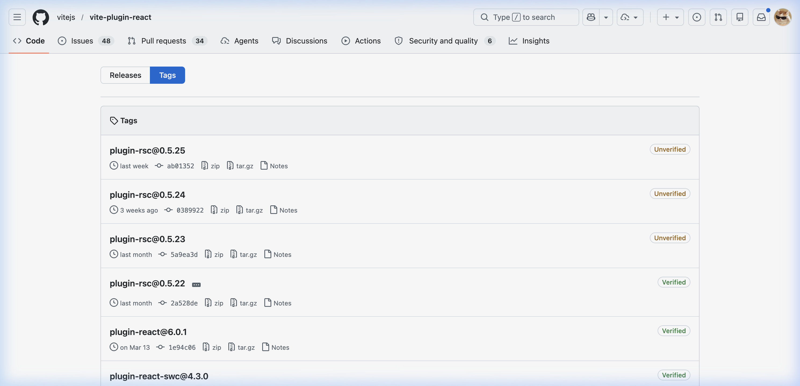
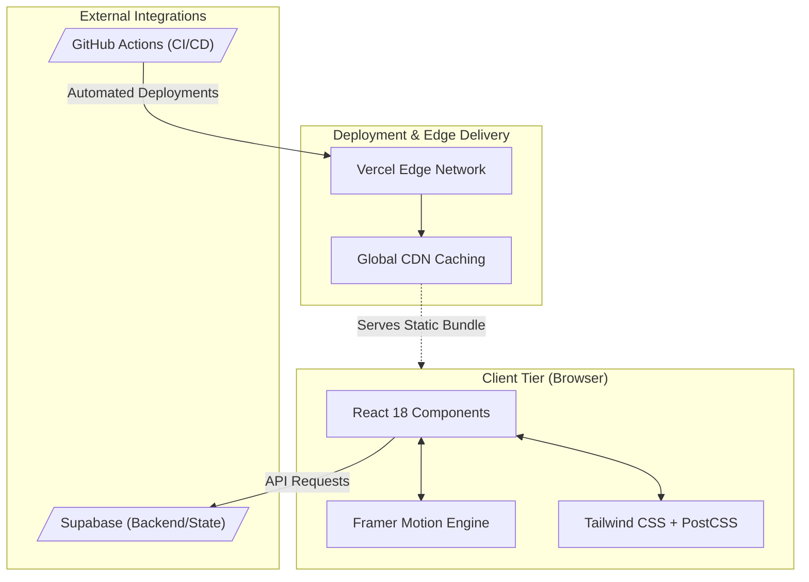

<div align="center">



<br/>


<p align="center">
  <a href="https://reactjs.org/"></a>
  <a href="https://tailwindcss.com/"></a>
  <a href="https://www.framer.com/motion/"></a>
  <a href="https://vitejs.dev/"></a>
</p>

<h3>
  <a href="https://www.harshithkumar.in">🚀 Live Demo</a>
  <span> · </span>
  <a href="https://github.com/Harshithk951/My-Portfolio/issues">🐛 Report Bug</a>
  <span> · </span>
  <a href="mailto:mharshithkumar6@gmail.com">📧 Contact Me</a>
</h3>

</div>

---

## 🚀 Executive Summary


This repository houses the source code for my **high-performance, motion-driven developer portfolio**. Designed to sit at the bleeding edge of **Artificial Intelligence** and **Modern Web Development**, the architecture is built for extreme speed, fluid cinematic animations, and unparalleled visual storytelling.

It utilizes an advanced **glassmorphic UI**, **bento-style grid layouts**, and a dynamic **macOS-style floating dock** to deliver a premium user experience.

---

## 🏗️ System Design & Architecture


The portfolio is architected using a modern decoupled frontend pattern, prioritizing edge delivery and client-side rendering performance.



### Component Hierarchy
The UI is built on atomic design principles:
- **Core Layout**: `App.jsx` handles routing, lazy loading, and core state.
- **Sections**: Modularized into `Hero`, `Projects`, `Skills`, `CTASection`.
- **Primitives**: Reusable micro-components (`mac-os-dock`, buttons, cards) styled via Tailwind utility classes and animated via Framer variants.

---

## ✨ Premium Features


* 🎨 **Sophisticated UI**: Dark-themed glassmorphism using deep custom CSS utility variables for a highly premium, liquid look.
* ⚡ **Cinematic Animations**: Micro-interactions powered by Framer Motion, utilizing exact spring physics and staggered DOM reveals.
* 📱 **Fluid Responsiveness**: Mobile-first grid systems with pixel-perfect scaling across all device viewports.
* 🛠️ **Optimized Engineering**: Lazy loading, intelligent code splitting, and extreme asset optimization for sub-second load times.
* ♿ **Inclusive Design**: ARIA-labeled interactive elements and semantic HTML for perfect screen reader compatibility.
* 🚀 **Smart Navigation**: A custom-built, scroll-aware macOS style floating dock that dynamically tracks viewport intersections.

---

## 🛠️ Technical Ecosystem


### Core Technologies
| Layer | Tech Stack | Purpose |
| --- | --- | --- |
| **Frontend Framework** | React 18 | Component architecture & fast virtual DOM |
| **Styling Engine** | Tailwind CSS | Utility-first rapid styling and responsive design |
| **Animation Engine** | Framer Motion | Declarative physics-based animations |
| **Build Tooling** | Vite | Lightning-fast HMR and optimized production bundles |
| **Icons** | React Icons / Lucide | Lightweight, scalable vector icons |

---

## 📂 Project Structure

```bash
My-Portfolio/
├── public/                 # Static global assets (Images, CV, PWA Service Workers)
├── src/
│   ├── components/         # High-level React components
│   │   ├── layout/         # Structural components (Navbar, Footer, FloatingDock)
│   │   ├── sections/       # Page sections (Hero, Projects, Skills)
│   │   └── ui/             # Reusable primitives (Buttons, Cards, Modals)
│   ├── lib/                # Utility functions and standard helpers (cn, formatters)
│   ├── App.jsx             # Root layout & composition logic
│   └── index.css           # Global CSS tokens, reset, and custom animations
├── index.html              # Entry point
└── vite.config.js          # Vite build and plugin configuration
```

---

## 🚦 Quick Start


### 1️⃣ Clone the Repository
```bash
git clone https://github.com/Harshithk951/My-Portfolio.git
cd My-Portfolio
```

### 2️⃣ Install Dependencies
```bash
npm install
# or
yarn install
```

### 3️⃣ Run Development Server
```bash
npm run dev
```
Open `http://localhost:5173` in your browser.

---

## 📊 Performance & SEO Benchmarks


The portfolio is continuously audited to maintain perfection across core web vitals.

| Category       | Score | Metric Focus |
| -------------- | ----- | ------------ |
| **Performance**    | 🟢 98+ | FCP, LCP, TBT optimization |
| **Accessibility**  | 🟢 100 | Contrast, ARIA labels, semantic tags |
| **Best Practices** | 🟢 100 | HTTPS, secure dependencies, no console errors |
| **SEO**            | 🟢 100 | Meta tags, robots.txt, dynamic sitemap |

---

## 🤝 Connect With Me


<div align="center">

[](https://www.linkedin.com/in/harshith-kumar-dev/)
[](https://github.com/Harshithk951)
[](mailto:mharshithkumar6@gmail.com)

**Harshith Kumar**  
*Building the future with code and intelligence.*

⭐ **If you like this project or find it helpful, please give it a star!** ⭐

</div>
